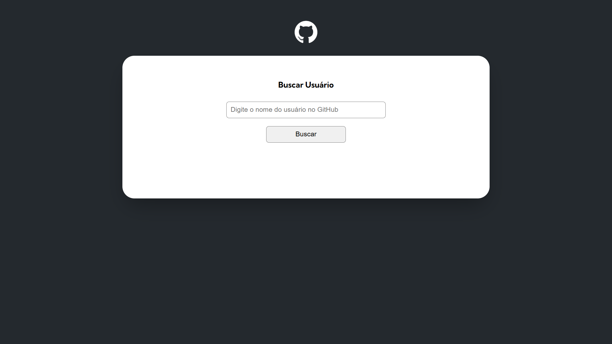

# Projeto Inicial Fetch GitHub API

Repositório contendo os arquivos iniciais do projeto de Fetch e GitHub API.

<div align="center">

</div>

## Descrição

Este projeto é uma aplicação web que utiliza a API do GitHub para buscar e exibir informações sobre repositórios e usuários. O objetivo é fornecer uma interface simples e intuitiva para interagir com a API do GitHub.

## Tecnologia

- HTML
- CSS
- JavaScript

## Instalação

Para configurar o projeto localmente, siga os passos abaixo:

1. Clone o repositório:
   ```bash
   git clone https://github.com/seu-usuario/projeto-inicial-fetch-github-api.git
   ```
2. Navegue até o diretório do projeto:
   ```bash
   cd projeto-inicial-fetch-github-api
   ```
3. Abra o arquivo `index.html` em um navegador para visualizar a aplicação.

## Uso

Após abrir o arquivo `index.html`, você poderá interagir com a aplicação e realizar buscas na API do GitHub digitando o nome de um usuário válido. É responsivo para mobile e desktop.

<div align="center">

</div>

## Contribuição

Contribuições são bem-vindas! Sinta-se à vontade para abrir issues ou enviar pull requests..
